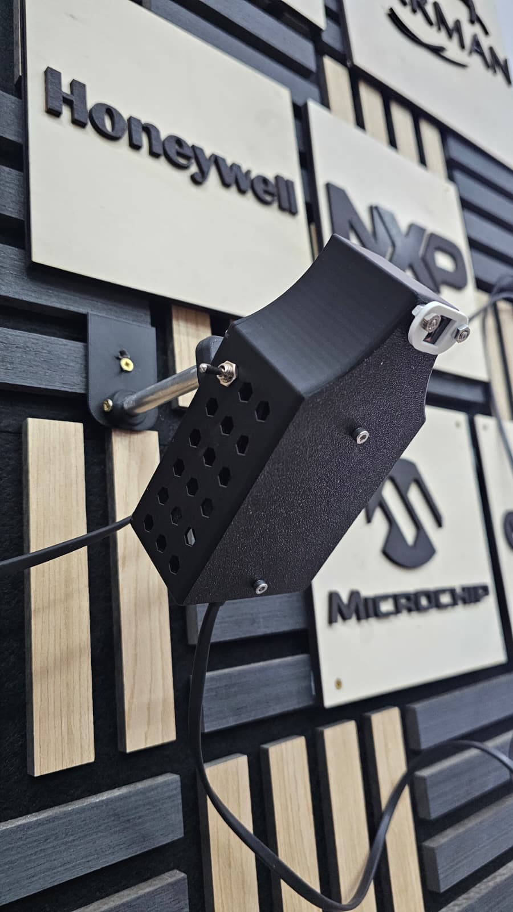
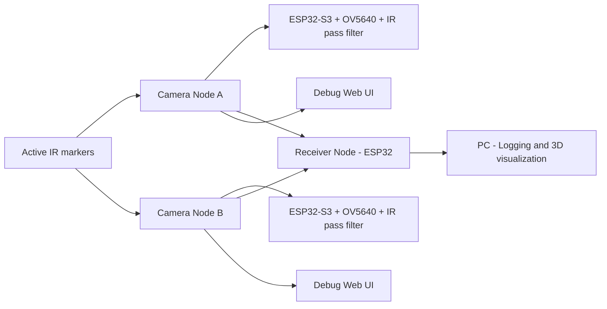
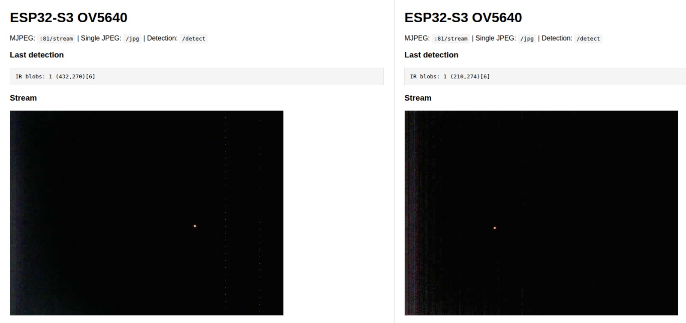

# wireless_mocap — Wireless IR Marker Tracking + Stereo Triangulation (ESP32-S3 + OV5640 + ESP-NOW)

This project is a **wireless IR marker tracking prototype** built with **ESP32-S3** boards and **OV5640** (DVP/parallel) camera modules. Each camera node detects bright **IR markers** (with an IR-pass filter on the lens), then transmits **marker centroid coordinates (x, y)** over **ESP-NOW** to a receiver node. The receiver aggregates detections from the first two senders and computes a **3D point (X, Y, Z)** via stereo triangulation.

---

## Table of contents

- [1. Hardware](#1-hardware)
  - [1.1 Top-level diagram](#11-top-level-diagram)
  - [1.2 Bill of Materials (BOM)](#12-bill-of-materials-bom)
  - [1.3 Wiring schematic (pin map)](#13-wiring-schematic-pin-map)
  - [1.4 Physical setup](#14-physical-setup)
- [2. Software](#2-software)
  - [2.1 Repository layout](#21-repository-layout)
  - [2.2 Data flow](#22-data-flow)
  - [2.3 Detection pipeline](#23-detection-pipeline)
  - [2.4 ESP-NOW packet format](#24-esp-now-packet-format)
  - [2.5 Triangulation (receiver)](#25-triangulation-receiver)
- [3. Testing and results](#3-testing-and-results)
  - [3.2 Performance notes](#32-performance-notes)
- [4. Demo video](#4-demo-video)
- [5. Build and run](#5-build-and-run)
  - [5.1 PlatformIO prerequisites](#51-platformio-prerequisites)
  - [5.2 Flash camera nodes](#52-flash-camera-nodes)
  - [5.3 Flash receiver node](#53-flash-receiver-node)
  - [5.4 Optional: PC visualization](#54-optional-pc-visualization)
- [6. Troubleshooting](#6-troubleshooting)

---

## 1. Hardware



### 1.1 Top-level diagram



### 1.2 Bill of Materials (BOM)

| Item | Qty | Notes |
|---|---:|---|
| ESP32-S3 DevKitC-1 (N32R8V / similar) | 2–3 | 2× camera nodes + 1× receiver (receiver can be an ESP32/ESP32-S3) |
| OV5640 camera module (Adafruit OV5640 breakout, DVP/parallel) | 2 | One per camera node |
| IR-pass filter (visible-blocking) | 2 | Mounted in front of each lens |
| IR marker(s) | 1+ | Active IR LED markers recommended for strong contrast |
| Stable 5V power (USB) | 2–3 ||
| Jumper wires / short ribbon | — | Keep DVP wires short to reduce timing/noise issues |
| Optional: rigid bar / mounts / tripods | 1 | Stable baseline improves triangulation accuracy |

### 1.3 Wiring schematic (pin map)

This project uses the OV5640’s **DVP parallel** interface plus SCCB control. The mapping below matches the pin definitions used in the firmware.

#### OV5640 → ESP32-S3 (camera node)

| OV5640 signal | ESP32-S3 GPIO | Notes |
|---|---:|---|
| PWDN | 15 | Used to power-cycle the camera on boot (recommended) |
| RESET | — | Not wired (configured as `-1`) |
| SIOD (SDA) | 4 | SCCB data |
| SIOC (SCL) | 5 | SCCB clock |
| VSYNC | 6 | Frame sync |
| HREF | 7 | Line valid |
| PCLK | 13 | Pixel clock |
| XCLK | Internal (module) | Firmware uses internal clock (`pin_xclk = -1`) |
| D0 | 11 | Pixel data |
| D1 | 9 | Pixel data |
| D2 | 8 | Pixel data |
| D3 | 10 | Pixel data |
| D4 | 12 | Pixel data |
| D5 | 18 | Pixel data |
| D6 | 17 | Pixel data |
| D7 | 16 | Pixel data |
| 3V3 | 3V3 | Camera power |
| GND | GND | Common ground |

**Important notes**
- If RESET is not wired, the sensor may remain in a bad state after flashing; a short **PWDN power-cycle** on boot helps.
- Keep the DVP bus wires short. Parallel camera timing is sensitive.
- If you reconfigure the OV5640 breakout for **external XCLK**, you must wire an ESP32 output GPIO to XCLK and set `pin_xclk` and `xclk_freq_hz` accordingly.

### 1.4 Physical setup

1. Mount the two camera nodes rigidly.
2. Measure the **baseline B** (meters) between camera optical centers.
3. Keep cameras as parallel as possible to reduce y-disparity and simplify matching.
4. Install IR-pass filters to suppress visible light and improve detection robustness.

---

## 2. Software

### 2.1 Repository layout

Typical project layout:
- `IRCamera-OV5640/` — camera node firmware (capture, detection, ESP-NOW sender, optional stream UI)
- `IRCamera-Receiver/` — receiver firmware (ESP-NOW receive, sender identification, triangulation)
- `calibration/` — calibration artifacts/scripts (intrinsics/distortion)

### 2.2 Data flow

**Camera node**
1. Capture frames in **JPEG** (high throughput).
2. Copy the latest JPEG into a shared buffer protected by a mutex.
3. Detection task:
   - decode JPEG → RGB565 at a reduced scale (speed)
   - compute luminance, threshold
   - connected components → blob centroids
4. Send centroids over ESP-NOW.

**Receiver node**
1. Receive ESP-NOW packets and identify sender by **source MAC**.
2. Keep “latest detections” for the first two senders (left/right).
3. Match points by y-proximity constraint.
4. Triangulate and print **X,Y,Z** in meters.

### 2.3 Detection pipeline

Detection is optimized for embedded constraints:

- JPEG capture from OV5640 (fast on ESP32-S3 with PSRAM)
- Scaled JPEG decode for detection (trade-off: speed vs tiny marker fidelity)
- Luma thresholding (IR marker is the brightest region in the frame)
- Run-length connected components labeling (lower memory than full BFS masks)

**Trade-off**
- `JPG_SCALE_4X`: fastest, can miss very small markers.
- `JPG_SCALE_2X`: slower, better for small markers.
- Full-scale decode: best fidelity, often too slow for high-FPS detection.

### 2.4 ESP-NOW packet format

A compact packet is used for marker centroids:

- Header: magic + seq + sender timestamp + count
- Payload: `count` pairs of `(int16 x, int16 y)` interleaved

Conceptual:

```c
#pragma pack(push,1)
typedef struct {
  uint32_t magic;   // 'MKRP'
  uint32_t seq;
  uint32_t ms;
  uint8_t  count;
  int16_t  xy[count*2]; // x0,y0,x1,y1,...
} MarkerPacket;
#pragma pack(pop)
```

The receiver uses the ESP-NOW **source MAC** to determine which sender transmitted the packet.

### 2.5 Triangulation (receiver)

The receiver computes a 3D point using calibrated camera parameters:

1. Pixel → normalized coordinates using intrinsics `(fx, fy, cx, cy)`.
2. Optional iterative undistortion using OpenCV radial-tangential coefficients `(k1, k2, p1, p2, k3)`.
3. Parallel/rectified stereo triangulation:

- `Z = B / (xL - xR)`
- `X = xL * Z`
- `Y = yL * Z`

Output format used by the receiver:

```
X,Y,Z = <X> <Y> <Z> (m)
```

---

## 3. Testing and results

### Debug interface


Performance depends on:
- capture resolution (QVGA vs VGA)
- JPEG quality (compression vs image artifacts)
- decode scale for detection
- PSRAM availability and frame buffer count
- Wi-Fi debug streaming (if enabled)

As a rule:
- JPEG capture can run near ~25–30 FPS on ESP32-S3 (configuration dependent).
- Detection FPS is usually limited by JPEG decode + blob extraction.

| Capture mode | Capture FPS | Detection mode | Detection FPS | Maximum marker distance recognition |
|---|---:|---|---:|---:|
| VGA  | 27 | VGA           | 3  | 3 m   |
| VGA  | 27 | 2× downscale  | 5  | 2.5 m |
| QVGA | 27 | QVGA          | 4  | 2.5 m |
| QVGA | 27 | 2× downscale  | 10 | 1.5 m |
| QVGA | 27 | 4× downscale  | 20 | 1 m   |


---

## 4. Demo video


---

## 5. Build and run

### 5.1 PlatformIO prerequisites

- PlatformIO (VS Code extension recommended)
- Arduino framework for ESP32
- USB drivers for ESP32-S3 DevKitC-1

### 5.2 Flash camera nodes

1. Open `IRCamera-OV5640/` in PlatformIO.
2. Verify camera pin map and settings in your config headers.
3. Build and upload to the first ESP32-S3 (Camera Node A).
4. Build and upload to the second ESP32-S3 (Camera Node B).
5. Confirm via Serial:
   - capture FPS
   - detection output (centroids)
   - ESP-NOW send status

### 5.3 Flash receiver node

1. Open `IRCamera-Receiver/` in PlatformIO.
2. Build and upload to the receiver ESP32.
3. Confirm Serial output shows `X,Y,Z = ... (m)` when both senders see the marker.

### 5.4 Optional: PC visualization

If you print `X,Y,Z = ... (m)` over USB Serial, you can plot the marker position in real time using a PC script (e.g., Python `pyserial` + visualization).

---

## 6. Troubleshooting

**Hot pixels / dots even when lens is covered**
- Common with high gain and long exposure.
- Lower exposure, lower gain, and/or enable bad-pixel correction if your driver exposes it.

**Detection too slow**
- Increase decode scale (4× is faster than 2×).
- Reduce resolution, reduce marker count printed/sent.
- Keep debug MJPEG stream disabled during performance measurements.

**ESP-NOW not receiving**
- Ensure sender and receiver are on the same Wi-Fi channel.
- If streaming over Wi-Fi, keep the receiver connected to the same SSID to lock the channel.

---
